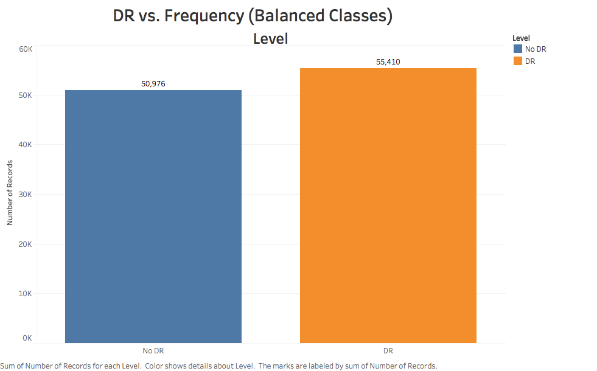

# DiabNet

## Detecting Diabetic Retinopathy Using Deep Learning

## Objective

Diabetic retinopathy is a leading cause of vision loss among the working-age population in developed countries, affecting an estimated 93 million people worldwide.

There is an urgent need for a comprehensive and automated approach to diabetic retinopathy screening. Previous efforts have shown promise using image classification, pattern recognition, and machine learning techniques. The aim of this project is to develop a new model using photos of eyes as input, with the goal of achieving clinical viability.

The motivations behind this project are twofold:

- Image classification has been a long-standing personal interest, particularly when applied to large-scale datasets.
- There is a significant delay between the time patients have their eyes scanned and when they receive a diagnosis and treatment plan. By processing images in real-time, DiabNet could enable patients to receive and act on their diagnosis on the same day.

## Table of Contents

1. [Data](#data)
2. [Exploratory Data Analysis](#exploratory-data-analysis)
3. [Preprocessing](#preprocessing)
    * [Download Images to EC2](#download-all-images-to-ec2)
    * [Crop & Resize Images](#crop-and-resize-all-images)
    * [Rotate and Mirror All Images](#rotate-and-mirror-all-images)
4. [CNN Architecture](#neural-network-architecture)
5. [Results](#results)
6. [Next Steps](#next-steps)
7. [References](#references)

## Data

The data originates from a [2015 Kaggle competition](https://www.kaggle.com/c/diabetic-retinopathy-detection). However, unlike typical Kaggle datasets, this one requires significant preprocessing as it hasn't been cleaned.

The dataset includes images taken from different individuals, using various cameras, and in multiple sizes. The data is noisy and requires extensive preprocessing to make the images suitable for model training.

The training set consists of 35,126 images, which are augmented during preprocessing.

## Exploratory Data Analysis

The first step was to analyze the distribution of the training labels. Although the dataset includes five categories, the plot below reveals a significant class imbalance.

Out of the original training data, 25,810 images are labeled as not having retinopathy, while 9,316 are labeled as having the condition.

To address this imbalance, specific steps were taken during [preprocessing](#preprocessing) and model training.

Additionally, there is considerable variance among images within the same class. The first two rows of images below represent class 0 (no retinopathy), while the last two rows represent class 4 (proliferative retinopathy).

  

## Preprocessing

The preprocessing pipeline includes the following steps:

1. Download all images to an EC2 instance using the [download script](src/download_data.sh).
2. Crop and resize all images using the [resizing script](src/resize_images.py) and the [preprocessing script](src/preprocess_images.py).
3. Rotate and mirror all images using the [rotation script](src/rotate_images.py).
4. Convert all images to NumPy arrays using the [conversion script](src/image_to_array.py).

### Download All Images to EC2

The images were downloaded using the Kaggle CLI. Running this on an EC2 instance allows you to download the entire dataset in approximately 30 minutes. The images are then organized into their respective folders and extracted from their compressed files. The original dataset totals 35 gigabytes.

### Crop and Resize All Images

All images were scaled down to 256x256 pixels. While this increases training time, it preserves more detail compared to a smaller size like 128x128.

During this process, 403 images were removed from the training set due to issues with their color space. These images, which were completely black, were excluded to prevent them from negatively impacting the model's performance.

### Rotate and Mirror All Images

All images underwent rotation and mirroring. Images without retinopathy were mirrored, while images with retinopathy were both mirrored and rotated by 90, 120, 180, and 270 degrees.

The images below illustrate the impact of cropping and rotations, showing a significant reduction in noise.

After these transformations, the class imbalance was corrected, resulting in a total of 106,386 images for the neural network to process.

## Neural Network Architecture

The model was built using Keras with TensorFlow as the backend, chosen for its superior performance compared to Theano and its compatibility with TensorBoard for network visualization.

DiabNet uses three convolutional layers with a depth of 32 each for binary classification. A Max Pooling layer with a size of (2,2) is applied after each convolutional layer.

After pooling, the data passes through a single dense layer of size 128 before reaching the output layer, which consists of 2 softmax nodes.

## Results

The DiabNet classifier was designed to detect the presence of retinopathy in patients. The current model has achieved the following performance metrics:

| Metric | Value |
| :-----: | :-----: |
| Accuracy (Train) | 82% |
| Accuracy (Test) | 80% |
| Precision | 88% |
| Recall | 77% |

These results indicate that the cropping process is helping improve the network's performance by removing irrelevant parts of the images, allowing the model to focus on the eye itself.

## Next Steps

1. Implement a system for the neural network to retrain itself with new images. This is a standard practice aimed at optimizing the model, with validation checks to ensure only high-quality images are used to prevent adverse effects on the classifier.

2. Convert the Keras model to CoreML and deploy it as part of a DiabNet iOS application. CoreML, a machine learning framework by Apple, allows Python developers to export their models, convert them to `.mlmodel` files, and integrate them into iOS apps.

The model will perform classifications on the local device, eliminating the need for an internet connection. This makes DiabNet particularly useful in remote areas where internet access may be limited.

## References

1. [What is Diabetic Retinopathy?](http://www.mayoclinic.org/diseases-conditions/diabetic-retinopathy/basics/definition/con-20023311)
2. [Diabetic Retinopathy Winners' Interview: 4th place, Julian & Daniel](http://blog.kaggle.com/2015/08/14/diabetic-retinopathy-winners-interview-4th-place-julian-daniel/)
3. [TensorFlow: Machine Learning For Everyone](https://youtu.be/mWl45NkFBOc)

## Tech Stack

